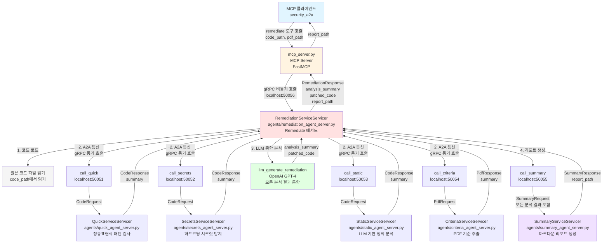

# 코드 취약점 분석 프로젝트

## 프로젝트 개요
코드 취약점 분석을 위한 AI 에이전트 기반 시스템

## 파일 구조

```
Code_Vulnerability/
│
├── mcp_server.py                    # MCP 서버 메인 파일
├── vulnerability.py                 # 테스트용 취약점 코드 샘플
├── 취약점검사.pdf                   # 보안 검사 기준 PDF 문서
├── pyproject.toml                   # 프로젝트 설정 및 의존성
├── README.md                        # 프로젝트 문서
│
├── agents/                          # AI 에이전트 모듈
│   ├── criteria_agent_server.py    # PDF에서 보안 기준 추출
│   ├── quick_agent_server.py       # 정규표현식 기반 빠른 패턴 검사
│   ├── secrets_agent_server.py     # 하드코딩된 시크릿 탐지
│   ├── static_agent_server.py      # LLM 기반 정적 분석
│   ├── summary_agent_server.py     # 스캔 결과 요약
│   └── remediation_agent_server.py # 개선된 코드 제안 및 A2A 루프
│
├── results/                         # 스캔 결과 저장
│   ├── sql_injection_analysis.md   # SQL 인젝션 취약점 분석 리포트
│   └── vulnerability_report.md     # 종합 취약점 분석 리포트
│
├── agents_pb2.py                    # gRPC 생성 코드 (Python)
├── agents_pb2_grpc.py              # gRPC 생성 코드 (gRPC)
└── agents.proto                     # gRPC 프로토콜 버퍼 정의
```

## 주요 파일 설명

### 핵심 파일
- **mcp_server.py**: Model Context Protocol 서버로, MCP 클라이언트가 Remediation Agent를 호출할 수 있도록 하는 메인 서버
- **vulnerability.py**: 의도적으로 취약점을 포함한 테스트 코드 샘플 (SQL Injection 등)

### AI 에이전트 모듈 (agents/)
- **criteria_agent_server.py**: PDF에서 보안 기준을 추출하는 에이전트
- **quick_agent_server.py**: 정규표현식 기반 빠른 패턴 검사
- **secrets_agent_server.py**: 하드코딩된 시크릿(비밀번호, 토큰 등) 탐지
- **static_agent_server.py**: LLM 기반 정적 분석
- **summary_agent_server.py**: 스캔 결과 요약
- **remediation_agent_server.py**: 개선된 코드 제안 및 A2A 루프

### 결과 파일 (results/)
- **sql_injection_analysis.md**: SQL Injection 취약점에 대한 상세 분석 리포트
- **vulnerability_report.md**: 전체 취약점에 대한 종합 분석 리포트

### gRPC 관련
- **agents.proto**: gRPC 프로토콜 버퍼 정의 파일
- **agents_pb2.py**: Python용 생성된 gRPC 코드
- **agents_pb2_grpc.py**: gRPC 서비스용 생성된 코드

## 시스템 아키텍처



## 워크플로우

### RemediationAgent 실행 과정 (Remediate 메서드)

#### 1. 코드 로드
- `code_path`에서 원본 코드 파일을 읽어 `code` 변수에 저장
- 파일 읽기 실패 시 에러 응답 반환

#### 2. A2A 통신 (Agent-to-Agent)
다른 에이전트들을 gRPC로 순차적으로 직접 호출하여 분석 결과 수집:

- **`call_quick(code_path)`** → `localhost:50051`
  - `QuickServiceServicer.Scan()` 호출
  - 정규표현식 기반 빠른 패턴 검사
  - 반환: `quick` (분석 결과 요약)

- **`call_secrets(code_path)`** → `localhost:50052`
  - `SecretsServiceServicer.Scan()` 호출
  - 하드코딩된 시크릿(비밀번호, 토큰 등) 탐지
  - 반환: `secrets` (발견된 시크릿 목록)

- **`call_static(code_path)`** → `localhost:50053`
  - `StaticServiceServicer.Analyze()` 호출
  - LLM 기반 정적 분석 (AST 파싱 + OpenAI API)
  - 반환: `static` (정적 분석 결과)

- **`call_criteria(pdf_path)`** → `localhost:50054`
  - `CriteriaServiceServicer.Extract()` 호출
  - PDF에서 보안 검사 기준 추출
  - 반환: `criteria` (PDF 기준 요약)

#### 3. LLM 종합 분석
- **`llm_generate_remediation(code, quick, secrets, static, criteria)`**
  - 수집한 모든 분석 결과를 OpenAI GPT-4에 전달
  - 종합 취약점 분석 및 개선된 코드 생성
  - 반환: `(analysis_summary, patched_code)` 튜플

#### 4. 리포트 생성
- **`call_summary(code_path, pdf_path, quick, secrets, static, criteria, remediation_summary, patched_code, report_path)`** → `localhost:50055`
  - `SummaryServiceServicer.WriteReport()` 호출
  - 모든 분석 결과와 개선 코드를 통합한 마크다운 리포트 생성
  - 반환: `report_path` (생성된 리포트 파일 경로)

#### 5. 응답 반환
- `RemediationResponse` 객체 생성
  - `analysis_summary`: LLM 종합 분석 요약
  - `patched_code`: 개선된 전체 코드
  - `report_path`: 생성된 리포트 파일 경로
- MCP 서버를 통해 클라이언트에 반환

### 각 에이전트 서버 포트

- **Quick Agent**: 50051
- **Secrets Agent**: 50052
- **Static Agent**: 50053
- **Criteria Agent**: 50054
- **Summary Agent**: 50055
- **Remediation Agent**: 50056

## 사용 방법

1. 각 에이전트 서버 실행 (각각 별도 터미널에서)
   ```bash
   python agents/quick_agent_server.py
   python agents/secrets_agent_server.py
   python agents/static_agent_server.py
   python agents/criteria_agent_server.py
   python agents/summary_agent_server.py
   python agents/remediation_agent_server.py
   ```

2. MCP 서버 실행
   ```bash
   python mcp_server.py
   ```

3. MCP 클라이언트에서 `remediate` 도구 호출
   - `code_path`: 분석할 코드 파일 경로
   - `pdf_path`: 기준 문서 PDF 파일 경로

4. 분석 결과는 `results/` 디렉토리에 저장됨

